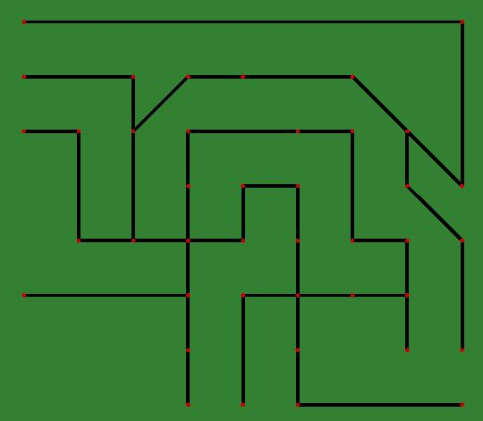
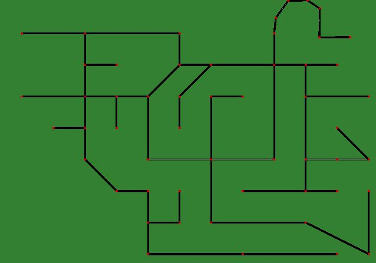
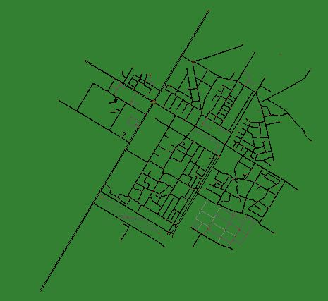
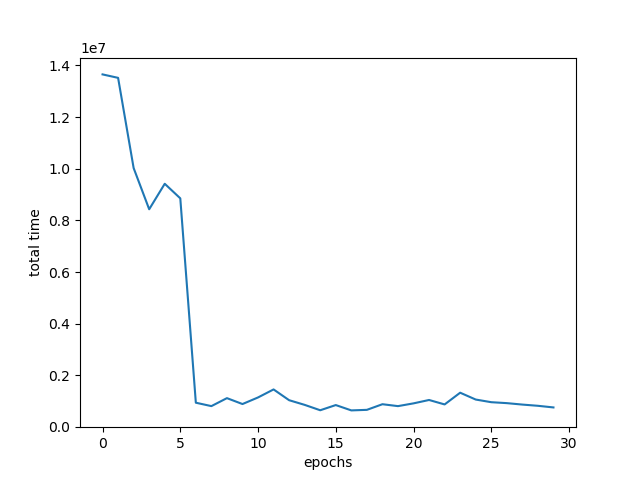
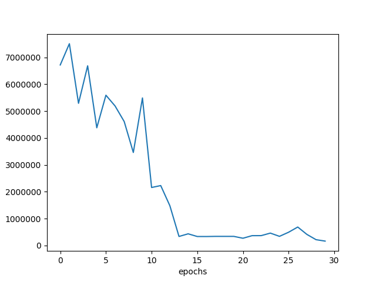
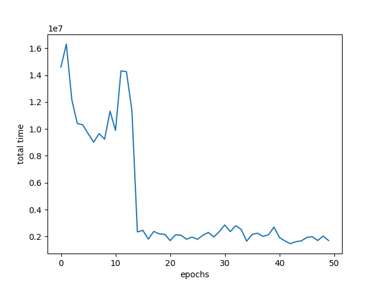
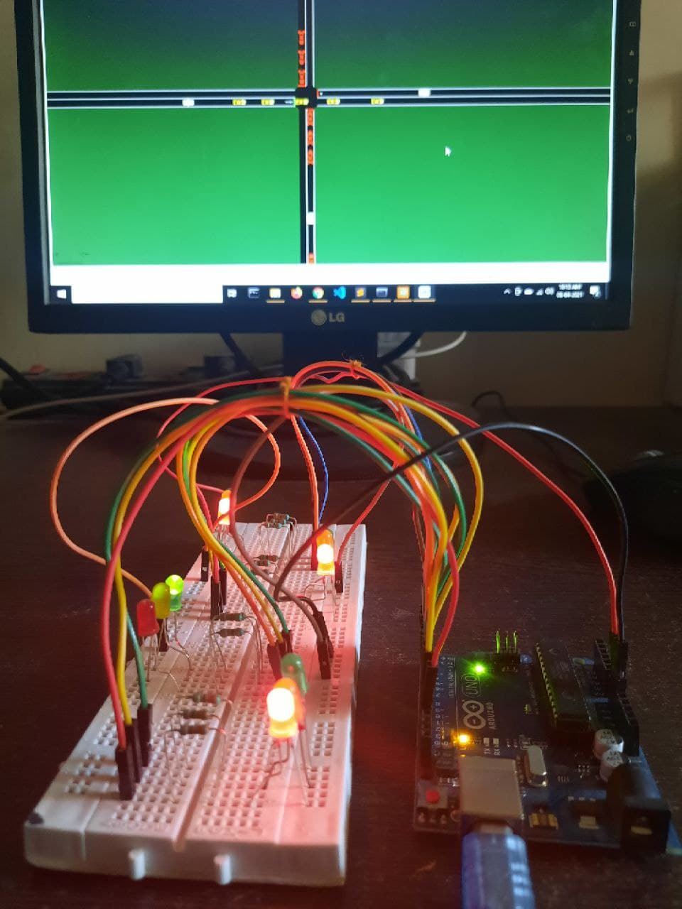
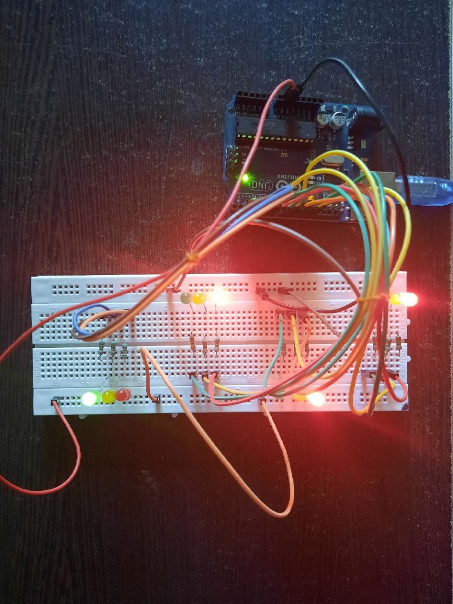
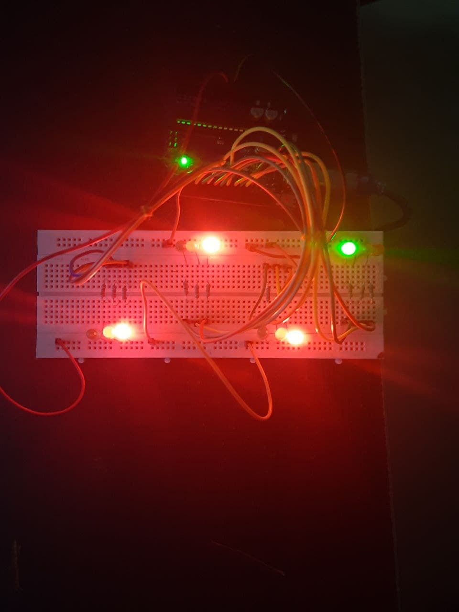

# 🚦 Traffic Optimization Using Reinforcement Learning

<div align="center">


> 🎓 **College Major Project** — B.Tech CSE, Sreenidhi Institute of Science and Technology, Hyderabad
>
> *A decentralized intelligent traffic signal control system using Deep Q-Networks (DQN) and SUMO simulation — trained across 3 city maps with 8 saved models — to dynamically minimize vehicle waiting time.*

</div>

---

## 📌 Table of Contents
- [Overview](#-overview)
- [Basic Idea](#-basic-idea)
- [Training Process](#-training-process)
- [Tech Stack](#-tech-stack)
- [Project Structure](#-project-structure)
- [Maps Used for Training](#-maps-used-for-training)
- [Training Results](#-training-results)
- [Live Simulation Demo](#-live-simulation-demo)
- [Arduino Integration](#-arduino-integration)
- [Installation](#-installation)
- [Usage](#-usage)
- [Author](#-author)

---

## 🔍 Overview

Traditional traffic lights run on **fixed timers** — they ignore real-time traffic density, causing unnecessary waiting and fuel waste.

This project builds a **Deep Q-Network (DQN) agent** that:
- Observes vehicle count on all 4 sides of every junction in real time
- Dynamically selects **which lane gets the green signal**
- Minimizes total vehicle waiting time across **all junctions simultaneously**
- Has been trained and tested on **3 different city map layouts**
- Includes optional **Arduino hardware integration** for physical traffic lights

---

## 💡 Basic Idea

Suppose we have a city grid with 4 traffic light nodes: **n1, n2, n3, n4**

- The model makes **one decision per node** — which side gets the green light
- A **minimum green time** is enforced so the model cannot switch signals too rapidly
- Waiting time per signal = total vehicles waiting × number of seconds
- Each junction tracks **4 waiting time counters** (one per side)
- The model's goal: **minimize total waiting time across all nodes**

The number of nodes scales with the size of the city grid.

---

## 🔄 Training Process

Training uses **fixed events** (pseudo-random vehicle routes) rather than random ones — this ensures reproducible, comparable results across experiments. Multiple fixed events teach the model to handle diverse traffic situations.

```
🚗 Vehicles enter SUMO simulation
        ↓
📡 Agent observes vehicle count per lane (state = 4 values per junction)
        ↓
🧠 DQN selects action → which lane gets green signal
        ↓
🚦 TraCI API applies the signal phase change
        ↓
📊 Reward = −1 × total vehicle waiting time
        ↓
💾 Best model saved if waiting time improves
        ↓
🔁 Repeat across epochs until convergence
```

### 🧠 DQN Hyperparameters

| Parameter | Value |
|---|---|
| Algorithm | Deep Q-Network (DQN) |
| Input (State) | Vehicle count per lane — 4 values per junction |
| Output (Action) | 1 of 4 signal phases per junction |
| Reward | −1 × total waiting time |
| Hidden Layers | 2 × 256 neurons (ReLU activation) |
| Optimizer | Adam (lr = 0.1) |
| Loss Function | Mean Squared Error (MSE) |
| Discount Factor γ | 0.99 |
| Epsilon Start | 0.0 (greedy during test) |
| Epsilon Decay | 5e-4 |
| Epsilon Minimum | 0.05 |
| Max Memory | 100,000 transitions per junction |
| Batch Size | 1024 |

---

## 🛠️ Tech Stack

| Technology | Purpose |
|---|---|
| Python | Core language |
| PyTorch | DQN model implementation |
| SUMO | Traffic simulation environment |
| TraCI API | Real-time Python ↔ SUMO communication |
| NumPy | State arrays and memory buffers |
| Matplotlib | Training performance plots |
| Arduino (optional) | Physical LED traffic light hardware |

---

## 📁 Project Structure

```
traffic-optimization-rl/
│
├── train.py                        # Main DQN training & testing script
├── configuration.sumocfg           # SUMO config (currently set to city1)
├── tripinfo.xml                    # Vehicle trip output from simulation
├── requirements.txt                # Python dependencies
│
├── maps/                           # All SUMO network & route files
│   ├── city1.net.xml / city1.rou.xml
│   ├── city2.net.xml / city2.rou.xml
│   ├── city3.net.xml / city3.rou.xml
│   ├── citysample.net.xml / citysample.rou.xml
│   ├── network.net.xml → network4.net.xml
│   ├── routes.rou.xml → routes4.rou.xml
│   └── randomTrips.py              # Script to generate route files
│
├── models/                         # 8 saved trained model weights
│   ├── model.bin
│   ├── model_city.bin
│   ├── model_city1.bin
│   ├── model_city1_2.bin
│   ├── model_city1_3.bin
│   ├── model_city2.bin
│   ├── model_city3.bin
│   └── model_city_1_test.bin
│
├── plots/                          # Training graphs (time vs epoch)
│   ├── time_vs_epoch_city1.png
│   ├── time_vs_epoch_city3.png
│   ├── time_vs_epoch_model.png
│   └── time_vs_epoch_model_city_1_test.png
│
├── maps_images/                    # Screenshots of city maps
│   ├── city2.JPG
│   ├── city3.JPG
│   ├── citymap.JPG
│   └── ezgif.com-gif-maker.gif.mp4 # Demo video
│
├── arduino_images/                 # Arduino hardware photos
│   ├── arduino1.jpg
│   ├── arduino2.jpg
│   └── arduino3.jpg
│
└── trafficlight_2/                 # Arduino sketch + single-junction version
    ├── trafficlight_2.ino
    ├── train.py
    ├── configuration.sumocfg
    └── requirements.txt
```

---

## 🗺️ Maps Used for Training

Three city maps were designed using SUMO's netedit tool:

### Map 1


### Map 2


### Map 3


---

## 📊 Training Results

Total vehicle waiting time decreasing across training epochs — confirming the agent is learning:

### Epoch vs Time — City 1


### Epoch vs Time — City 3


### Epoch vs Time — Base Model


---

## 🎬 Live Simulation Demo

https://user-images.githubusercontent.com/44360315/113673665-e8edd300-96d6-11eb-8fbe-d09e078fbfbe.mp4

*Trained model running on SUMO-GUI — the agent dynamically controls signal phases based on live vehicle counts.*

---

## 🔌 Arduino Integration

The simulation is connected to a physical Arduino board to control real LED traffic lights, bridging software and hardware.

> ⚠️ Arduino currently supports **single crossroad only**. Multi-junction support returns an error.

### Arduino Setup




---

## 🚀 Installation

### Prerequisites
- Python 3.8+
- [SUMO + SUMO-GUI](https://sumo.dlr.de/docs/Downloads.php)
- Set `SUMO_HOME` environment variable

### Install dependencies
```bash
git clone https://github.com/RekhaChittaloori/traffic-optimization-rl.git
cd traffic-optimization-rl
pip install -r requirements.txt
```

### Set SUMO_HOME
```bash
# Windows
set SUMO_HOME="C:\path\to\sumo"

# Linux / Mac
export SUMO_HOME="/path/to/sumo"
```

---

## 💻 Usage

### Generate route files for a new map
```bash
cd maps
python randomTrips.py -n network.net.xml -r routes.rou.xml -e 500
```

### Configure SUMO (edit configuration.sumocfg)
```xml
<input>
  <net-file value='maps/city1.net.xml'/>
  <route-files value='maps/city1.rou.xml'/>
</input>
```

### Train a new model
```bash
python train.py --train -e 50 -m model_name -s 500
```

### Test a trained model (with GUI)
```bash
python train.py -m model_name -s 500
```

### Run with Arduino hardware
```bash
python train.py -m model_name -s 500 --ard
```

### All CLI options

| Flag | Description | Default |
|---|---|---|
| `--train` | Enable training mode | False (test mode) |
| `-m` | Model name to save/load | `model` |
| `-e` | Number of training epochs | 50 |
| `-s` | Simulation steps per epoch | 500 |
| `--ard` | Enable Arduino integration | False |

> 💡 Use the same `-s` value for both training and testing for accurate results.

---

## 🔭 Future Scope

- [ ] Cooperative multi-agent learning across junctions
- [ ] Real city maps via OpenStreetMap
- [ ] Pedestrian and cyclist signal support
- [ ] Compare DQN with PPO / A3C algorithms
- [ ] Raspberry Pi deployment for edge computing

---

## 👩‍💻 Author

**Chittaloori Rekha**
B.Tech CSE — Sreenidhi Institute of Science and Technology, Hyderabad

[](https://www.linkedin.com/in/rekha-chittaloori-b21b56278/)
[](https://github.com/RekhaChittaloori)
[](https://leetcode.com/u/Rekha8/)

---

<div align="center">
  <i>⭐ If you found this project useful, please consider giving it a star!</i>
</div>
